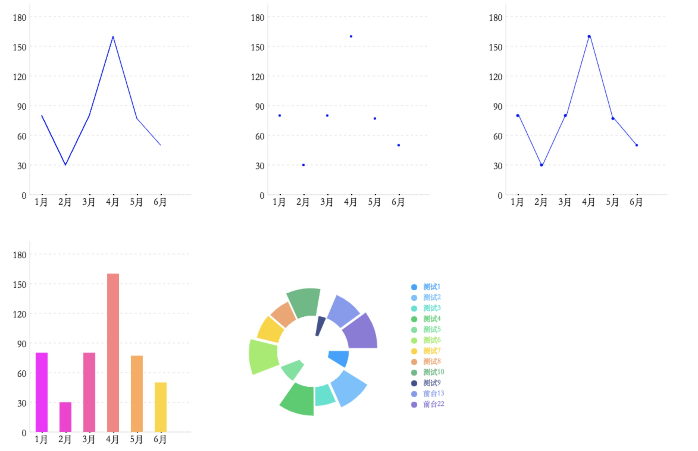
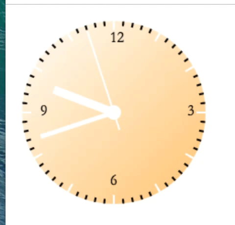
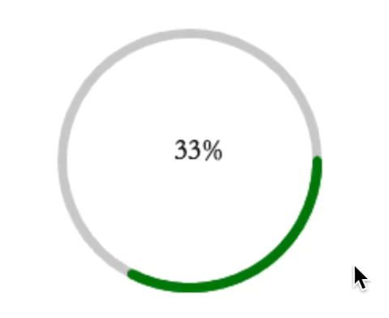
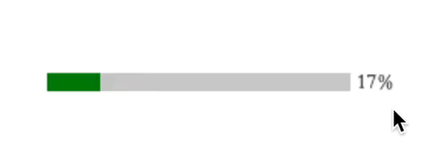
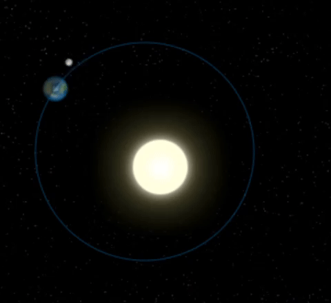
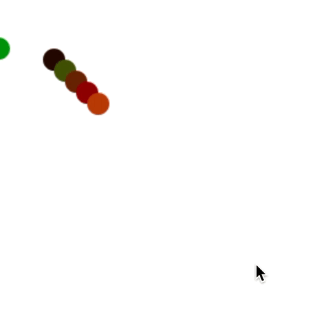
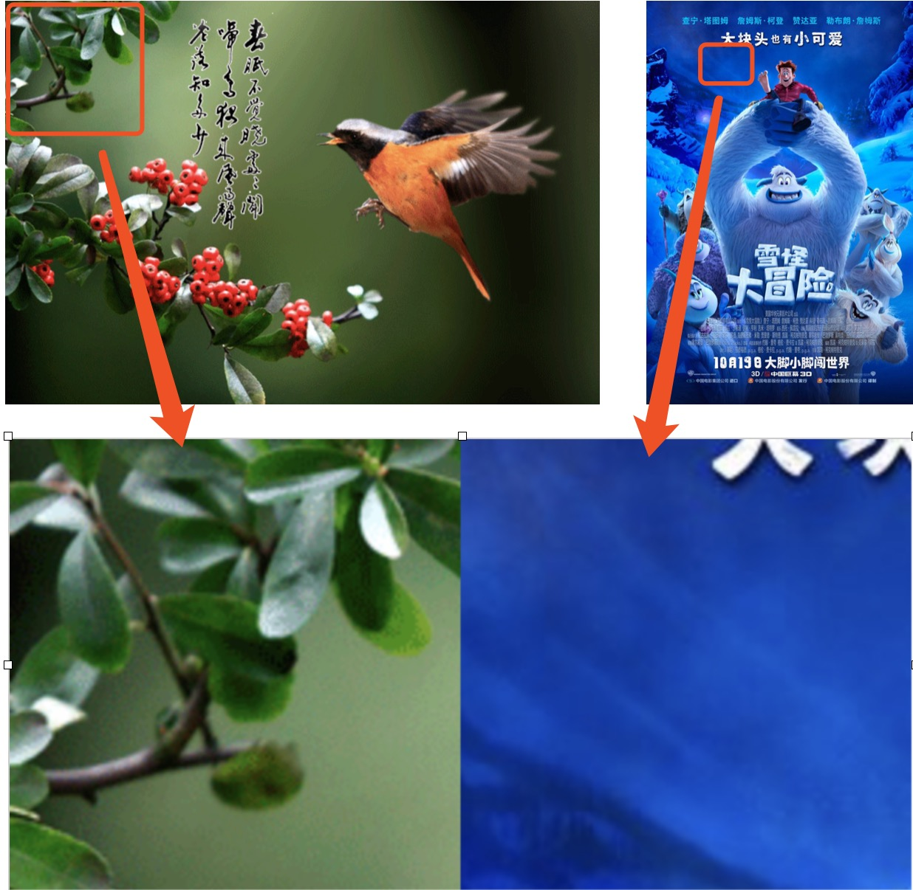
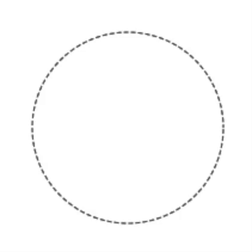
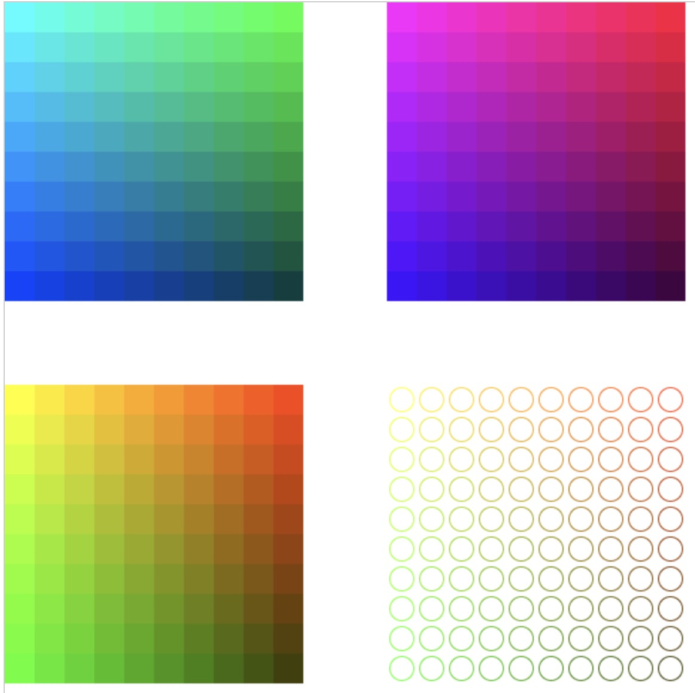
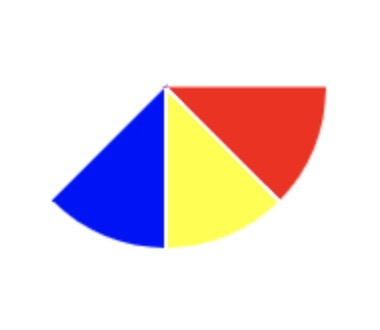

# canvas
**canvas入门教程demo**
**教程正在更新中，地址：[canvas入门](https://blog.csdn.net/wjk_along/article/category/8301799)**
## 1.图表(chart)

## 2.钟表(clark)

## 3.进度条

## 4.太阳系

## 5.跳动小球

## 6.图片裁切

## 7.虚线圆

## 8.颜色

## 9.扇形画法

